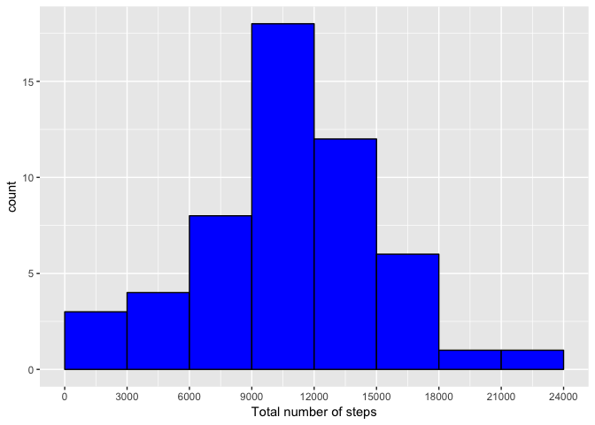
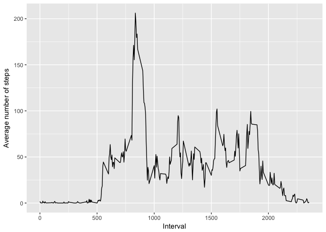
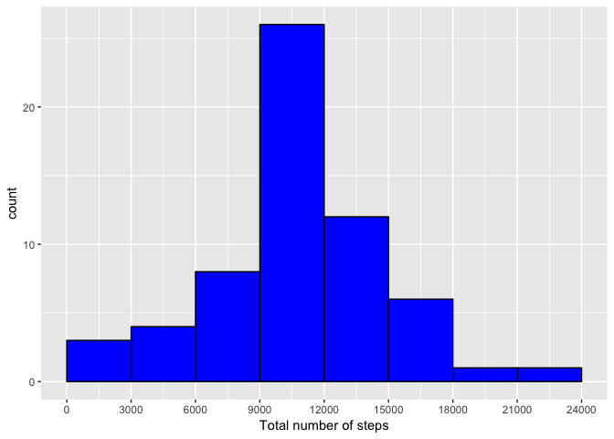
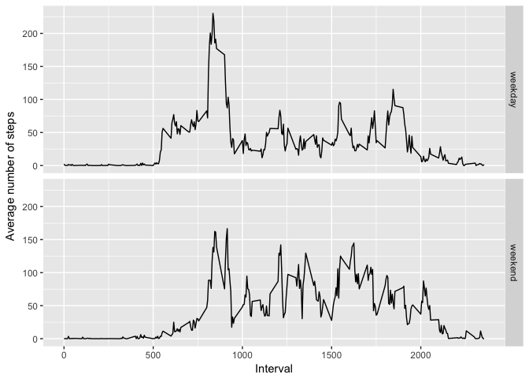

# Reproducible Research: Peer Assessment 1


## Loading and preprocessing the data

```r
data <- read.csv("activity.csv")
data$date <- as.Date(data$date)
```

## What is the mean total number of steps taken per day?

First, group the data by date and calculate the total steps per day.

```r
library(dplyr)
```

```
## 
## Attaching package: 'dplyr'
```

```
## The following objects are masked from 'package:stats':
## 
##     filter, lag
```

```
## The following objects are masked from 'package:base':
## 
##     intersect, setdiff, setequal, union
```

```r
grouped_date <- data %>% group_by(date) %>% summarize(total_steps = sum(steps))
```

Create the histogram of the total steps per day

```r
library(ggplot2)
ggplot(grouped_date, aes(total_steps)) + geom_histogram(breaks = seq(0,24000,by = 3000), fill = "blue", color = "black") + scale_x_continuous("Total number of steps", breaks = seq(0,24000,by = 3000))
```

```
## Warning: Removed 8 rows containing non-finite values (stat_bin).
```

<!-- -->

Finally, calculate the mean and median of the total steps per day

```r
mean_steps = mean(grouped_date$total_steps, na.rm = T)
median_steps = median(grouped_date$total_steps, na.rm = T)
options(scipen=999)
```

The mean total steps per day is 10766.1886792 and the median steps per day is
10765

## What is the average daily activity pattern?
Group data by intervals and calculate average steps per interval. Then, plot the results.

```r
grouped_interval <- data %>% group_by(interval) %>% summarize(avg_steps = mean(steps, na.rm = T))
ggplot(grouped_interval, aes(interval, avg_steps)) + 
    geom_line() + 
    labs(x = "Interval") + 
    labs(y = "Average number of steps")
```

<!-- -->

Finally, determine the interval with the maximum number of average steps

```r
max_steps_interval <- with(grouped_interval, interval[which.max(avg_steps)])  
```
The interval of the maximum number of average steps is 835

## Imputing missing values
Calculate the number of NA values.

```r
NA_num <- sum(is.na(data$steps))
```
The number of NA values in the steps variable is 2304.

To impute the NA values, we use the average number of steps per interval across all days. We created an imouted version of the data.

```r
data_imputed <- cbind(data)
na_flag = is.na(data$steps)
for (i in seq_len(dim(data_imputed)[1])){
    if(na_flag[i]) {
        data_imputed$steps[i] <- grouped_interval$avg_steps[grouped_interval$interval == data_imputed$interval[i]] }
}
```

Create a histogram of the total number of steps taken each day using the imputed data.

```r
grouped_date_imp <- data_imputed %>% group_by(date) %>% 
    summarize(total_steps = sum(steps))
ggplot(grouped_date_imp, aes(total_steps)) + 
    geom_histogram(breaks = seq(0,24000,by = 3000), fill = "blue", color = "black") + 
    scale_x_continuous("Total number of steps", breaks = seq(0,24000,by = 3000))
```

<!-- -->

Now, we calculate the mean and the median values of the total steps per day using the imputed data.

```r
mean_steps = mean(grouped_date_imp$total_steps, na.rm = T)
median_steps = median(grouped_date_imp$total_steps, na.rm = T)
options(scipen=999)
```
In this case, the mean total steps per day is 10766.1886792 and the median steps per day is 10766.1886792. Compared to the not imputed data, the mean values are the same, while the median values are essentially identical. Thus, imputting the NA values using the average steps per interval doesn't produce an appreciable effect.

## Are there differences in activity patterns between weekdays and weekends?
We create a new factor variable which identifies weekdays and weekend

```r
weekday = c("Monday","Tuesday","Wednesday","Thursday","Friday")
data_imputed$day <- factor((weekdays(data$date) %in% weekday),
                           levels = c(TRUE,FALSE), 
                           labels = c("weekday","weekend"))
```
Now, we calculate the average number of steps per interval per type of day and plot the result separated by type of day.

```r
grouped_day_interv <- data_imputed %>% group_by(day,interval) %>% 
    summarize(avg_steps = mean(steps))
ggplot(grouped_day_interv, aes(interval, avg_steps, )) + 
    facet_grid(day ~.) +
    geom_line() + 
    labs(x = "Interval") + 
    labs(y = "Average number of steps")
```

<!-- -->
